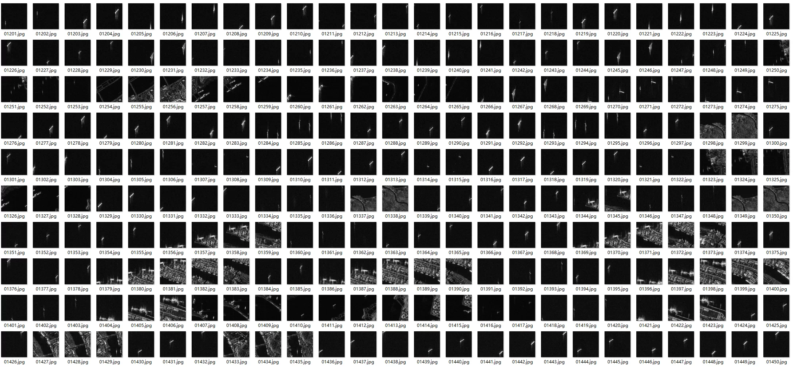
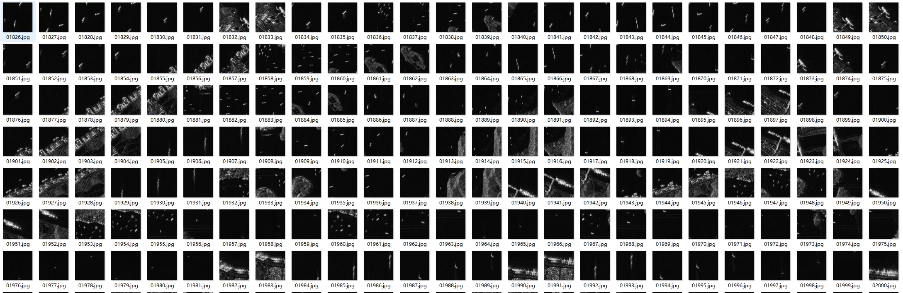
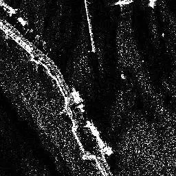
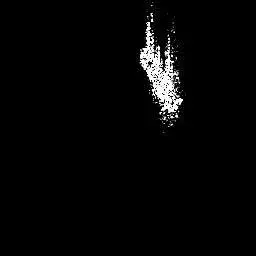
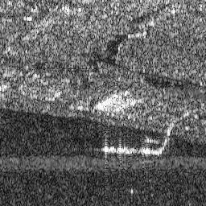
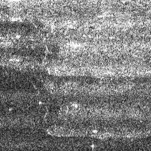

## Body

SAR Image Target Detection Dataset (including large-scale scene images)

Content: The dataset utilizes data from the HISEA-1 satellite and the Gaofen-3 satellite, comprising a total of 28,449 slice images and 12 large-scale images. It covers various scenes such as airports, ports, nearshore areas, islands, open seas, and cities. The target types are divided into four categories: airplanes, oil tanks, bridges, and ships, with a total of 1,851 bridges, 39,858 vessels, 12,319 oil tanks, and 6,368 aircraft.

Image specifications: The vast majority are 256×256 pixels, with some bridge samples being 2048×2048; 24bit three-channel grayscale JPG.

Annotation: A supporting XML annotation file is included, containing bounding box coordinates for xmin/xmax/ymin/ymax.

The dataset file contains 28,449 images and corresponding annotations✅ XML annotation
Labeled Large Scene Images file contains 3 complete large-scale wide images✅ XML annotation
Large Scene Original Images file contains 9 complete large-scale wide images❌ No annotations at all

## Images

item_1070476720830

Here is a pay link on Stripe ( https://buy.stripe.com/3cs8yP7sY87d0vu9AB ). Please contact me lonlonago@foxmail.com after funding $89, and I will send you a complete data files , thank you!

